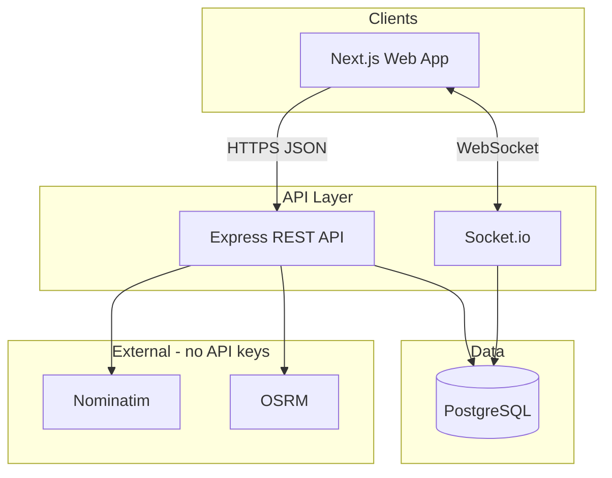

# QuickMove Architecture

> Master architecture reference. See also `docs/RFC.md`, `docs/ARCHITECTURE.md`, `docs/API.md`.

## System context

## Current implementation (v0.3)
- **Monolith API** (`server/`): Express + TypeScript + Prisma + Socket.io
- **Web client** (`client/`): Next.js 14 App Router, shadcn/ui, Leaflet
- **Database**: PostgreSQL 15
- **Geo**: Nominatim geocoding, OSRM routing, haversine fallback, multi-leg `routeThrough`
- **Auth**: JWT access tokens (15m) + opaque refresh tokens with rotation; rate-limited auth endpoints
- **Realtime**: Socket.io rooms (`user:`, `driver:`, `booking:`) + Redis adapter when `REDIS_URL` set
- **Payments**: Wallet ledger, test gateway intents
- **Multi-stop**: `BookingStop` waypoints on bookings; fare from full route
- **Chat**: Per-booking messages via REST history + Socket.io live delivery
- **Coupons/Invoices**: Discount codes + tax invoice generation
- **KYC**: Driver document upload stubs + admin verification
- **Admin ops**: Live driver map, DB-backed pricing rules
- **Observability**: Prometheus `/metrics`, OpenTelemetry SDK, Grafana dashboards

## Target evolution (documented, incremental)
- Modular services: booking, pricing, location, matching, notifications, payments
- Event bus: Kafka for booking lifecycle events (where it adds value)
- Search: Elasticsearch for address/driver search at scale
- Full OpenTelemetry SDK + Grafana dashboards

## Module map

| Module | Current location | Responsibility |
|--------|-----------------|----------------|
| Auth | `controllers/auth`, `middlewares/auth`, `services/sessions` | Register, login, JWT, refresh, RBAC |
| Geo | `controllers/geo`, `utils/geo` | Search, route, distance |
| Pricing | `utils/pricing`, `services/pricingRules` | Fare quotes, surge, admin rules |
| KYC | `controllers/kyc` | Document stubs, admin review |
| Observability | `observability/metrics`, `observability/tracing` | Prometheus, OTel SDK |
| Admin | `controllers/admin` | Approvals, stats, live map, pricing |
| Booking | `controllers/booking` | CRUD, cancel, rate, multi-stop |
| Chat | `controllers/chat`, `socket.ts` | Message history, live chat |
| Payments | `controllers/payment`, `services/payments` | Wallet, intents, test gateway |
| Matching | `services/matching` | Offer jobs to nearby drivers |
| Driver | `controllers/driver` | Offers, accept, status, location, KYC |
| Notifications | `services/notifications`, `services/realtime` | DB + socket push |
| Realtime | `socket.ts` | Live location, status sync |

## Deployment (target)
- Local: `docker-compose` (postgres + redis + server + client)
- CI: GitHub Actions (`.github/workflows/ci.yml`)
- Production: Kubernetes manifests under `deploy/k8s/`
- Load tests: `deploy/k6/run.sh smoke.js` (requires running API + optional seed)
- IaC stubs: `deploy/terraform/` (VPC, RDS, ElastiCache)
- Metrics: `GET /metrics` + `deploy/observability/prometheus.yml`

See `docs/` for detailed sequence diagrams and API contracts.
