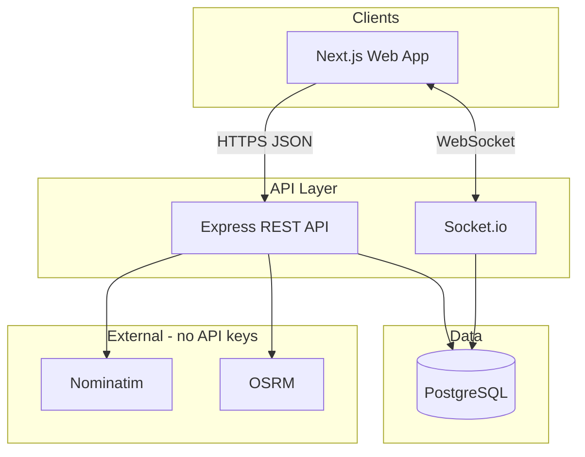

# QuickMove Architecture

> Master architecture reference. See also `docs/RFC.md`, `docs/ARCHITECTURE.md`, `docs/API.md`.

## System context

## Current implementation (v0.3)
- **Monolith API** (`server/`): Express + TypeScript + Prisma + Socket.io
- **Web client** (`client/`): Next.js 14 App Router, shadcn/ui, Leaflet
- **Database**: PostgreSQL 15
- **Geo**: Nominatim geocoding, OSRM routing, haversine fallback, multi-leg `routeThrough`
- **Auth**: JWT Bearer tokens, role-based guards (USER/DRIVER/ADMIN)
- **Realtime**: Socket.io rooms (`user:`, `driver:`, `booking:`) + Redis adapter when `REDIS_URL` set
- **Payments**: Wallet ledger, test gateway intents
- **Multi-stop**: `BookingStop` waypoints on bookings; fare from full route
- **Chat**: Per-booking messages via REST history + Socket.io live delivery

## Target evolution (documented, incremental)
- Redis: Socket.io adapter, pub/sub, fare cache, session store
- Modular services: booking, pricing, location, matching, notifications, payments
- Event bus: Kafka for booking lifecycle events (where it adds value)
- Search: Elasticsearch for address/driver search at scale
- Observability: OpenTelemetry traces, Prometheus metrics, Grafana dashboards

## Module map

| Module | Current location | Responsibility |
|--------|-----------------|----------------|
| Auth | `controllers/auth`, `middlewares/auth` | Register, login, JWT, RBAC |
| Geo | `controllers/geo`, `utils/geo` | Search, route, distance |
| Pricing | `utils/pricing` | Fare quotes, surge |
| Booking | `controllers/booking` | CRUD, cancel, rate, multi-stop |
| Chat | `controllers/chat`, `socket.ts` | Message history, live chat |
| Payments | `controllers/payment`, `services/payments` | Wallet, intents, test gateway |
| Matching | `services/matching` | Offer jobs to nearby drivers |
| Driver | `controllers/driver` | Offers, accept, status, location |
| Admin | `controllers/admin` | Approvals, stats |
| Notifications | `services/notifications`, `services/realtime` | DB + socket push |
| Realtime | `socket.ts` | Live location, status sync |

## Deployment (target)
- Local: `docker-compose` (postgres + server + client)
- CI: GitHub Actions (`.github/workflows/ci.yml`)
- Production: Kubernetes manifests under `deploy/k8s/`

See `docs/` for detailed sequence diagrams and API contracts.
