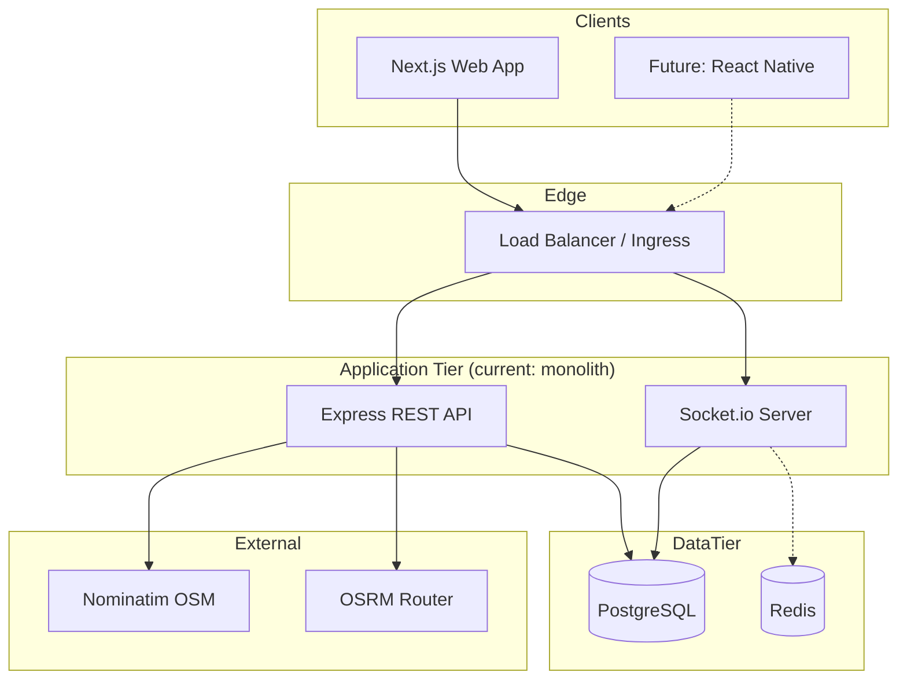
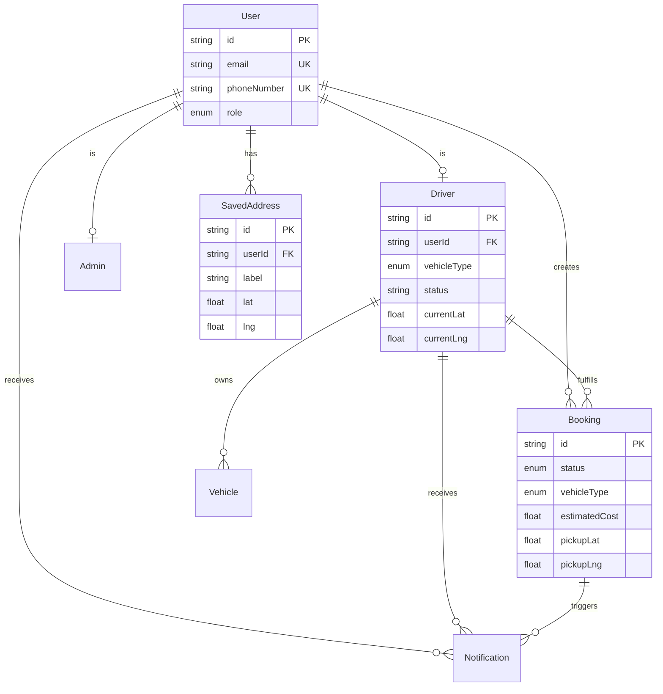
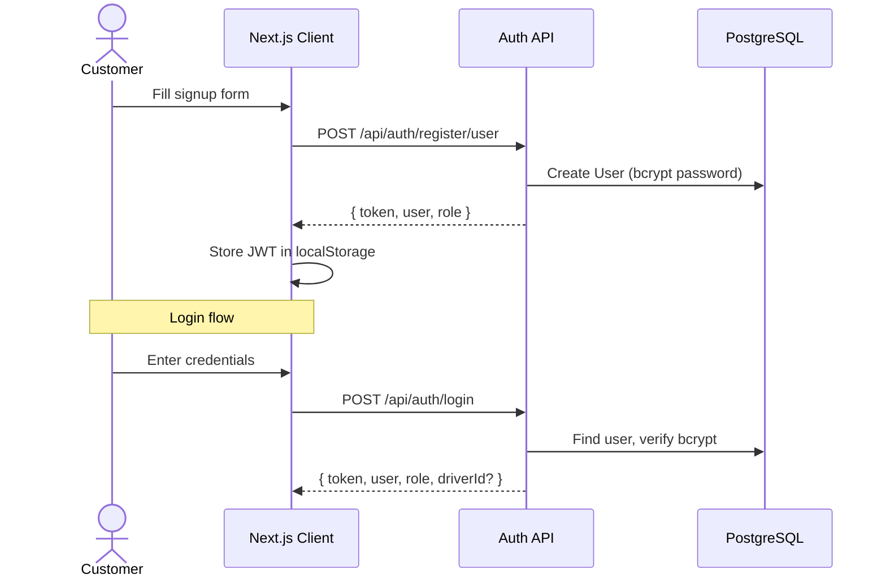
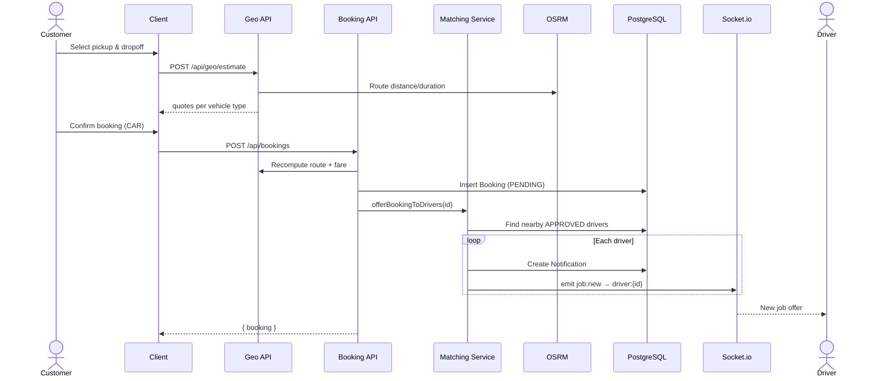
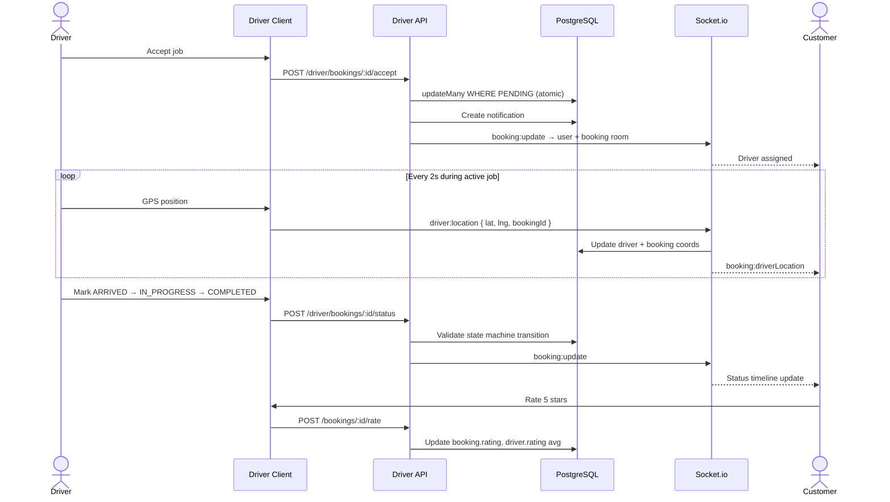
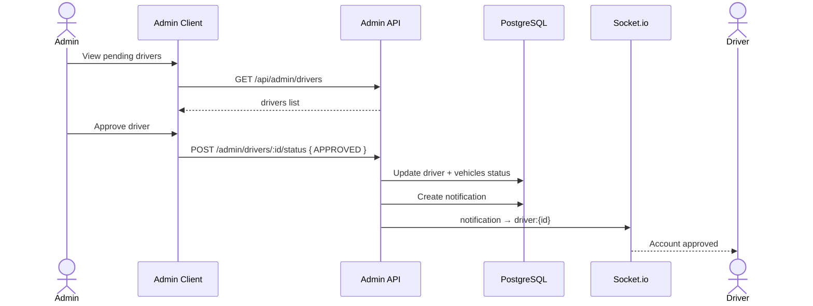
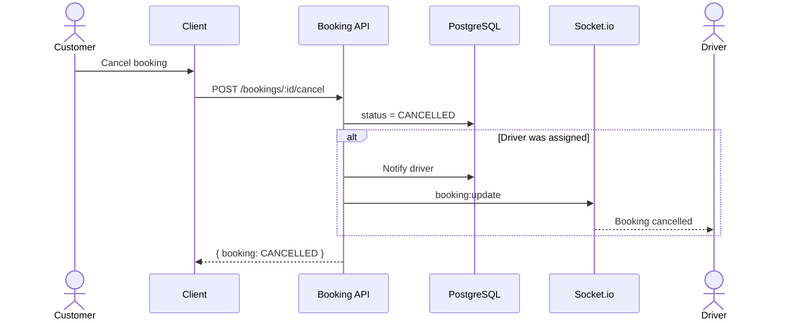
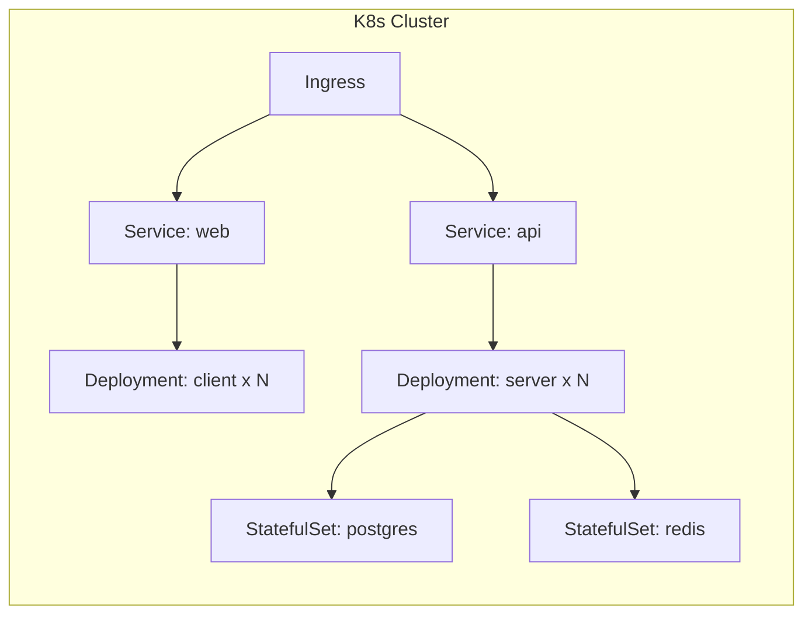

# QuickMove — High-Level Design (HLD)

## 1. Purpose
QuickMove is a real-time logistics and moving marketplace connecting customers
who need goods moved with nearby drivers (bike → big truck). The platform
provides instant fare quotes, driver matching, live GPS tracking, and
role-specific dashboards for customers, drivers, and admins.

## 2. Architecture overview



### Current vs target
| Concern | Current (v0.3) | Target |
|---------|----------------|--------|
| API | Single Express process | Modular services behind API gateway |
| Realtime | In-process Socket.io | Redis adapter + dedicated WS pods |
| Events | Synchronous in handlers | Kafka topics for booking lifecycle |
| Search | Nominatim proxy | Self-hosted Nominatim + ES for drivers |
| Payments | Modelled, unpaid | Stripe/Razorpay test + wallet ledger |
| Observability | Console logs | OTel SDK + Prometheus + Grafana stubs |

## 3. Component responsibilities

### 3.1 Customer web (`client/`)
- Landing, auth, booking wizard, live tracking map
- Driver/admin dashboards
- JWT in localStorage, Socket.io client with room registration

### 3.2 API server (`server/`)
| Module | Routes | Responsibility |
|--------|--------|----------------|
| Auth | `/api/auth` | Register/login, JWT issuance |
| User | `/api/user` | Profile, saved addresses |
| Geo | `/api/geo` | Address search, fare estimate |
| Booking | `/api/bookings` | Create, list, cancel, rate |
| Driver | `/api/driver` | Offers, accept, status, location |
| Admin | `/api/admin` | Approvals, analytics |
| Notifications | `/api/notifications` | In-app notification feed |

### 3.3 Realtime layer (`socket.ts`)
- Rooms: `user:{id}`, `driver:{id}`, `booking:{id}`
- Events: `job:new`, `booking:update`, `booking:driverLocation`, `notification`
- Target: Redis pub/sub via `@socket.io/redis-adapter` for horizontal scale

### 3.4 Pricing engine (`utils/pricing.ts`)
```
fare = max(minFare, (base + km×rate + min×timeRate) × surge)
```
- Per-vehicle rate table (BIKE → BIG_TRUCK)
- Surge: 1.25× during peak hours (8–11, 17–21)
- Target: demand/supply ratio, city config, coupons, taxes

### 3.5 Matching (`services/matching.ts`)
1. Filter: APPROVED + available + matching `vehicleType`
2. Rank by haversine distance to pickup
3. Notify each driver (DB + `job:new` socket)
4. First atomic accept wins (`updateMany` conditional)

## 4. Data model (ER)



## 5. Sequence diagrams

### 5.1 User signup & login



### 5.2 Booking create → estimate → driver offer



### 5.3 Driver accept → live tracking → completion



### 5.4 Admin driver approval



### 5.5 Cancellation



## 6. Deployment architecture



Local development uses root `docker-compose.yml` (postgres + redis + server + client).

## 7. Scaling considerations
- **API**: Stateless; scale horizontally behind load balancer
- **WebSocket**: Requires sticky sessions or Redis adapter for multi-pod
- **Postgres**: Read replicas for analytics; connection pooling via PgBouncer
- **Geo**: Rate-limit Nominatim (1 req/s); cache geocode results in Redis
- **Matching**: Future: geospatial index (PostGIS) instead of haversine scan

## 8. Failure recovery
- OSRM/Nominatim down → haversine fallback (pricing still works)
- Socket disconnect → client auto-reconnects; REST remains source of truth
- Double accept → atomic `updateMany` returns 409 for loser
- DB migration → `prisma migrate deploy` in container startup

## 9. Security
- JWT Bearer auth with role guards
- bcrypt password hashing (cost 10)
- CORS locked to `CLIENT_ORIGIN`
- Target: refresh tokens, rate limiting, audit log table, OWASP headers

## 10. Observability (target)
- OpenTelemetry traces on all API routes
- Prometheus metrics: `booking_created_total`, `driver_accept_latency`, `ws_connections`
- Structured JSON logging with correlation IDs
