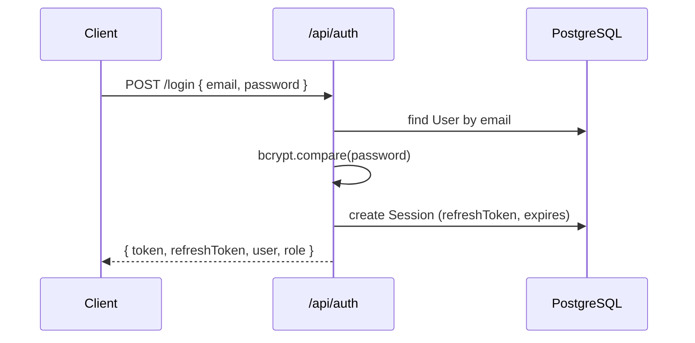
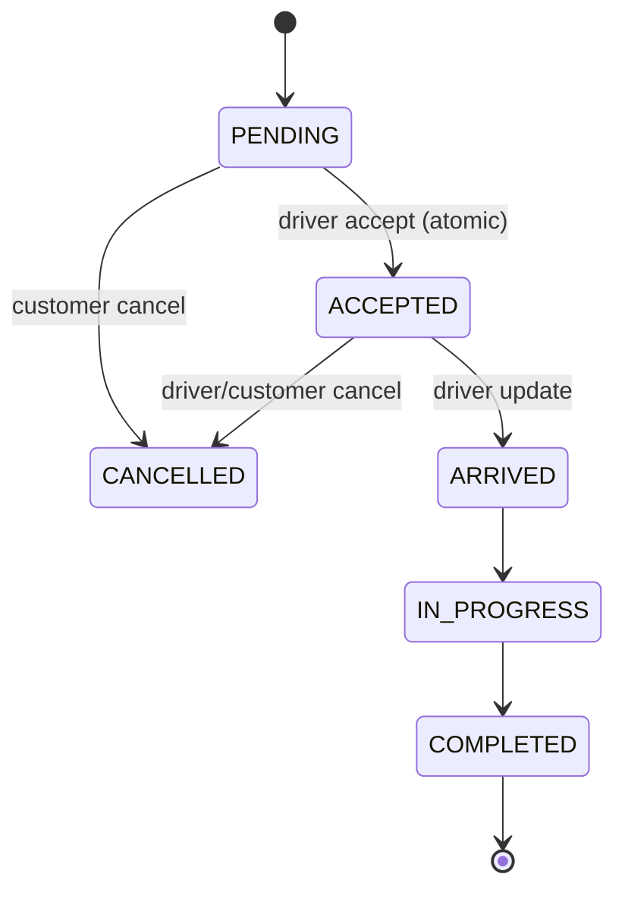

# QuickMove — Low-Level Design (LLD)

## 1. Scope
This document details module-level behaviour, data flows, and key algorithms
for the QuickMove monolith (API + Next.js client). See `docs/HLD.md` for
system context and `docs/API.md` for the HTTP contract.

## 2. Authentication & sessions

### 2.1 Token model
| Token | TTL | Storage | Purpose |
|-------|-----|---------|---------|
| Access JWT | 15 min | `localStorage` + optional cookie | API + Socket auth |
| Refresh token | 7 days | DB `Session` row | Rotate access without re-login |

### 2.2 Login flow


### 2.3 RBAC middleware chain
1. `requireAuth` — extract Bearer/cookie, verify JWT, set `req.auth`
2. `requireRole(...)` — compare `req.auth.role` against allowed roles
3. Driver routes additionally read `req.auth.driverId` from JWT claims

## 3. Booking lifecycle

### 3.1 State machine


### 3.2 Fare calculation (`utils/pricing.ts`)
1. Load per-vehicle rates from `PricingRule` cache (`services/pricingRules.ts`)
2. Compute distance via OSRM route (fallback: haversine × 1.3 road factor)
3. `total = max(minFare, base + perKm×km + perMin×min) × surgeMultiplier`
4. Surge: `peakSurge` from rule when local hour ∈ [8,10) ∪ [17,20)

### 3.3 Driver matching (`services/matching.ts`)
On `POST /api/bookings`:
1. Find APPROVED + `isAvailable` drivers with matching `vehicleType`
2. Sort by haversine distance to pickup
3. Emit `job:new` socket event to top N drivers (default 5)

### 3.4 Atomic accept
```sql
UPDATE Booking SET status='ACCEPTED', driverId=$driver
WHERE id=$id AND status='PENDING' AND driverId IS NULL
-- claim.count === 0 → 409 Conflict
```

## 4. Payments & earnings

### 4.1 Wallet ledger
- `Wallet` per user (1:1 with `User`)
- `WalletTransaction`: CREDIT/DEBIT with `reference` = bookingId when applicable

### 4.2 Payment confirm (`services/payments.ts`)
1. Debit customer wallet OR process test card token
2. Mark `PaymentIntent` SUCCEEDED, booking `paymentStatus=PAID`
3. Credit driver wallet 90% of intent amount as "Trip earnings"
4. Generate `Invoice` (subtotal, discount, 5% GST tax)

## 5. Realtime (Socket.io)

### 5.1 Rooms
| Room | Members | Purpose |
|------|---------|---------|
| `user:{userId}` | Customer socket | booking:update, notifications |
| `driver:{driverId}` | Driver socket | job:new |
| `booking:{bookingId}` | Both parties | chat, driver location |
| `admin:live` | Admin sockets | admin:driverLocation |

### 5.2 Location pipeline
1. Driver client: `navigator.geolocation.watchPosition` → `driver:location` emit
2. Server: persist `Driver.currentLat/Lng`, optional `Booking.driverLat/Lng`
3. Fan-out: `booking:driverLocation` to customer, `admin:driverLocation` to admins

### 5.3 Horizontal scale
When `REDIS_URL` is set, `@socket.io/redis-adapter` fans events across pods.

## 6. Observability

### 6.1 Prometheus (`GET /metrics`)
| Metric | Labels | When incremented |
|--------|--------|------------------|
| `quickmove_http_requests_total` | method, route, status | Every HTTP response |
| `quickmove_bookings_created_total` | — | Booking created |
| `quickmove_payments_succeeded_total` | — | Payment confirmed |

### 6.2 OpenTelemetry
- Enabled when `OTEL_EXPORTER_OTLP_ENDPOINT` is set
- `NodeSDK` + auto-instrumentations (HTTP, Express, Prisma)
- Export OTLP/HTTP to collector (Jaeger, Grafana Tempo, etc.)

## 7. Client architecture

### 7.1 Providers (root layout)
- `AuthProvider` — JWT, role, driverId, auto-refresh on 401
- `SocketProvider` — connect, `register` with userId/driverId/isAdmin
- `ThemeProvider` — dark/light mode

### 7.2 Key pages
| Route | Role | Primary APIs |
|-------|------|--------------|
| `/book` | USER | geo estimate, POST booking |
| `/bookings/[id]` | USER | tracking, chat, pay, invoice |
| `/driver` | DRIVER | offers, jobs, KYC, earnings, GPS |
| `/admin` | ADMIN | approvals, live map, pricing, coupons |

### 7.3 Component tests (Vitest + RTL)
- `lib/ui` helpers, `Badge`, `RequireRole` auth guard

## 8. Database indexes (recommended for scale)
Current schema uses Prisma defaults. Production should add:
- `Booking(status, vehicleType, driverId)` for offer queries
- `Driver(status, isAvailable, vehicleType)` for matching
- `WalletTransaction(walletId, createdAt)` for history pagination
